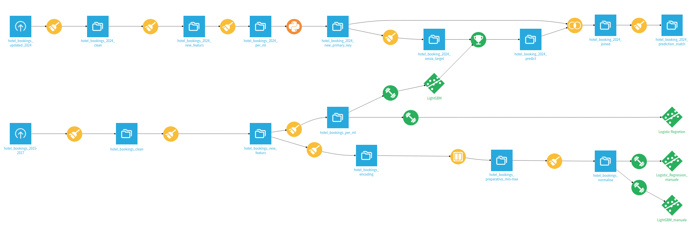
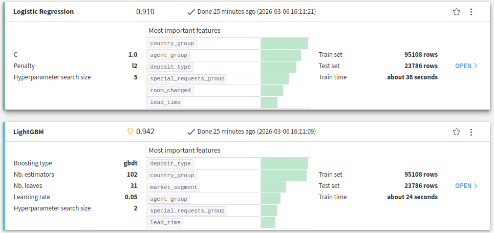

# Hotel Booking Cancellation Prediction

Progetto di Machine Learning focalizzato sulla previsione se una prenotazione alberghiera verrà **confermata o cancellata** utilizzando dati storici delle prenotazioni.

Il progetto esplora due approcci complementari per costruire una pipeline di Machine Learning:

• **Workflow visuale di Machine Learning utilizzando Dataiku DSS**  
• **Implementazione completa programmatica in Python**

L’obiettivo è sia la **modellazione predittiva**, sia la comprensione completa della pipeline di Machine Learning, dalla preparazione dei dati fino alla valutazione del modello e al test su nuovi dati.

---

# Motivazione del progetto

Le cancellazioni delle prenotazioni rappresentano una sfida importante per il settore alberghiero.  
Cancellazioni impreviste possono influenzare significativamente:

- la previsione dei ricavi
- la pianificazione dell’occupazione delle camere
- le strategie di prezzo
- la gestione dell’overbooking

Essere in grado di stimare la **probabilità che una prenotazione venga cancellata** consente agli hotel di prendere decisioni più informate e ottimizzare le strategie di business.

---

# Panoramica del progetto

Il progetto segue il tipico **ciclo di vita di un progetto di Machine Learning**:

1. Preparazione dei dati  
2. Feature engineering  
3. Addestramento del modello  
4. Valutazione del modello  
5. Applicazione del modello su nuovi dati  

L’intero workflow è stato inizialmente sviluppato utilizzando **Dataiku DSS**, e successivamente **ricostruito manualmente in Python** per riprodurre la stessa pipeline e comprendere meglio ogni fase del processo.

Questa doppia implementazione permette di confrontare:

- **workflow visuali di data science**
- **pipeline di Machine Learning sviluppate interamente in codice**

---

# Workflow di Machine Learning (Dataiku)

La prima versione della pipeline è stata sviluppata utilizzando **Dataiku DSS**, che fornisce un ambiente visuale per costruire workflow completi di data science.

La pipeline include:

- preparazione dei dataset  
- feature engineering  
- encoding e preprocessing  
- addestramento dei modelli  
- confronto tra modelli  
- applicazione del modello su nuovi dati  



Il workflow utilizza due dataset principali:

- **Dataset storico** utilizzato per l’addestramento del modello  
- **Dataset più recente (2024)** utilizzato per simulare un utilizzo reale del modello

La pipeline elabora i dati grezzi delle prenotazioni, genera nuove variabili, addestra modelli di classificazione e produce le previsioni.

---

# Confronto tra modelli

Diversi modelli di classificazione sono stati testati per valutare la capacità di prevedere la cancellazione delle prenotazioni.



I principali modelli valutati sono:

- Logistic Regression  
- LightGBM (Gradient Boosting)

Tra i modelli testati, **LightGBM ha ottenuto le migliori prestazioni complessive**.

---

# Implementazione in Python

Dopo aver costruito la pipeline in Dataiku, l’intero workflow è stato **reimplementato in Python**.

Questo passaggio è stato importante per:

- comprendere meglio ogni fase della pipeline di Machine Learning
- ricostruire manualmente le operazioni di preprocessing
- verificare che gli stessi risultati possano essere ottenuti senza strumenti visuali
- rendere il progetto completamente replicabile con librerie open source

La pipeline Python include:

- preparazione dei dati con **Pandas**
- feature engineering
- encoding e normalizzazione con **Scikit-learn**
- addestramento dei modelli
- valutazione delle prestazioni
- applicazione del modello su nuovi dati

---

# Workflow di Machine Learning

La pipeline di Machine Learning segue la seguente struttura logica:
```text
Raw Data
│
├── Data Cleaning
│
├── Feature Engineering
│
├── Encoding / Normalization
│
├── Train / Test Split
│
├── Model Training
│ ├── Logistic Regression
│ └── LightGBM
│
├── Model Evaluation
│
└── Prediction on New Dataset (2024)
```

---

# Feature Engineering

Sono state create diverse variabili aggiuntive per migliorare la capacità predittiva del modello.

Alcuni esempi includono:

- `country_group`
- `agent_group`
- `special_requests_group`
- `previous_cancellation_group`
- `hotel_group`
- indicatori comportamentali relativi alle prenotazioni dei clienti

Queste feature permettono di catturare pattern che non sono immediatamente visibili nel dataset originale.

---

# Valutazione del modello

I modelli sono stati valutati utilizzando diverse metriche standard per problemi di classificazione:

- ROC AUC
- Accuracy
- Precision
- Recall
- F1 Score
- Confusion Matrix

Queste metriche permettono una valutazione più completa delle prestazioni del modello, considerando anche lo **sbilanciamento tra prenotazioni confermate e cancellate**.

---

# Test del modello su nuovi dati

Per simulare uno scenario reale:

1. il modello è stato addestrato su dati storici  
2. la pipeline di preprocessing è stata ricostruita  
3. il modello addestrato è stato applicato a un **dataset più recente (2024)**  
4. le previsioni sono state confrontate con i risultati reali  

Questo passaggio permette di valutare la **capacità di generalizzazione del modello**.

---

# Feature più rilevanti

Il modello ha identificato alcune variabili con forte importanza predittiva:

- tipo di deposito (`deposit_type`)
- paese di provenienza del cliente
- segmento di mercato (`market_segment`)
- agente di prenotazione
- anticipo della prenotazione (`lead_time`)
- numero di richieste speciali

Queste variabili riflettono pattern comportamentali rilevanti nelle prenotazioni dei clienti.

---

# Insight di business

I risultati del modello suggeriscono diverse possibili strategie per gli hotel.

**Politiche di deposito**

Le prenotazioni senza deposito tendono ad avere una probabilità più alta di cancellazione.  
L’introduzione di depositi potrebbe ridurre questo fenomeno.

**Segmentazione dei clienti**

Diversi segmenti di clienti mostrano comportamenti di cancellazione differenti.

**Canali di prenotazione**

Alcuni agenti o canali di prenotazione possono essere associati a tassi di cancellazione più elevati.

**Analisi del lead time**

Le prenotazioni effettuate con largo anticipo mostrano spesso una probabilità maggiore di cancellazione.

---

# Struttura del progetto
```text
hotel-booking-ml-project
│
├── Dataiku
│ Export del workflow sviluppato in Dataiku DSS
│
├── python
│ Implementazione della pipeline di Machine Learning in Python
│ ├── hotel_booking_cancellation_model_notebook.ipynb
│ └── hotel_booking_cancellation_model_script.py
│
├── images
│ Screenshot del workflow e delle visualizzazioni del progetto
│
├── presentation
│ Slide di presentazione del progetto
│
└── README.md
```

---

# Presentazione del progetto

Nel repository è disponibile anche una presentazione che descrive il progetto, il workflow e le possibili implicazioni di business.

**Presentazione del progetto**

[Apri la presentazione](presentation/hotel_booking_cancellation_ml_project_Presentation.pdf)

---

# Tecnologie utilizzate

Python  
Pandas  
Scikit-learn  
LightGBM  
Matplotlib  
Dataiku DSS  

---

# Possibili sviluppi futuri

Alcuni possibili sviluppi futuri del progetto includono:

- ottimizzazione degli iperparametri
- esperimenti con cross-validation
- analisi di interpretabilità del modello con SHAP
- deployment del modello come API
- integrazione con dashboard di business intelligence

---

# Autore

Nataliia Borovyk

Studentessa Data Analyst  
Interessi: Machine Learning, Data Science e modellazione di sistemi informativi


